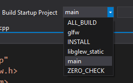

## A simple OpenGL application, producing user generated 3D graphics.

The focus of this project is to obtain experience in the following:
* Fammiliarize with using CMake for project handling
* Fammiliarize with Linux development
* Complete the LearnOpenGL tutorial found on https://learnopengl.com
* Implement graphics manipulaiton through my user created matrix calculation library (Translation, Scaling, Rotation) in 3D Space


The application uses Arthur Sonzogni OpenGL CMake Skeleton application. Introducing CMake with adding external dependencies was quite frustrating, and thus decided on a source skeleton application where all CMake configuration is taken care of. 

https://github.com/ArthurSonzogni/OpenGL_CMake_Skeleton

The MIT License (MIT)


Copyright (c) 2015 Arthur Sonzogni


Permission is hereby granted, free of charge, to any person obtaining a copy
of this software and associated documentation files (the "Software"), to deal
in the Software without restriction, including without limitation the rights
to use, copy, modify, merge, publish, distribute, sublicense, and/or sell
copies of the Software, and to permit persons to whom the Software is
furnished to do so, subject to the following conditions:

The above copyright notice and this permission notice shall be included in all
copies or substantial portions of the Software.

THE SOFTWARE IS PROVIDED "AS IS", WITHOUT WARRANTY OF ANY KIND, EXPRESS OR
IMPLIED, INCLUDING BUT NOT LIMITED TO THE WARRANTIES OF MERCHANTABILITY,
FITNESS FOR A PARTICULAR PURPOSE AND NONINFRINGEMENT. IN NO EVENT SHALL THE
AUTHORS OR COPYRIGHT HOLDERS BE LIABLE FOR ANY CLAIM, DAMAGES OR OTHER
LIABILITY, WHETHER IN AN ACTION OF CONTRACT, TORT OR OTHERWISE, ARISING FROM,
OUT OF OR IN CONNECTION WITH THE SOFTWARE OR THE USE OR OTHER DEALINGS IN THE
SOFTWARE.


## Usage (General):
Install CMake for your command line. 

## Usage (Linux + Unix Makefiles):

```bash
git clone --recursive https://github.com/RomulusC/3DGraphics.git
cd 3DGraphics
mkdir build
cd build
cmake Unix Makefiles ..
make
./main
```

## Usage (Windows + MSVC_17):
* I recommend using git for windows found here: https://gitforwindows.org/ ,
this prevents the setting up awkward environmental variables to access git through cmd.

* Install Microsoft Visual Studio 2017.
 * Follow commands below using git bash in desired directory. 
```bash
git clone --recursive https://github.com/RomulusC/3DGraphics.git
cd 3DGraphics
mkdir build
cd build
cmake -G "Visual Studio 15 2017" ..
```
* Open the Sandbox.sln
* Select the "Build Startup Project" to "main". 



* Run the project


